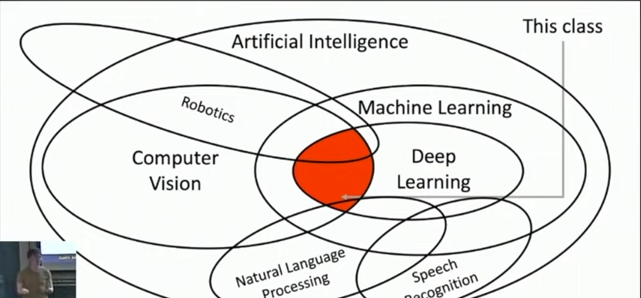
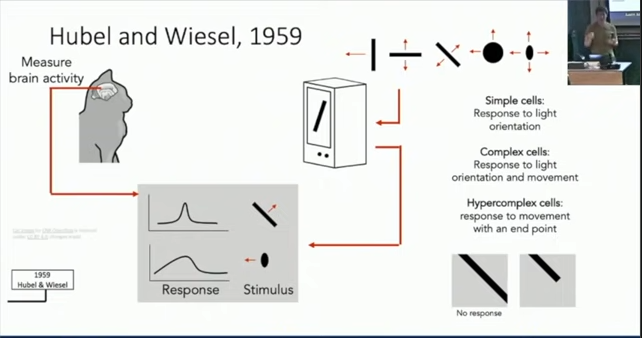
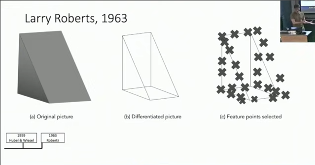

# Lecture 1: Introduction

Computer Vision -> Bulding artifical systems that process, preceive, and reason about visual data

Cameras all around us. 

Learning -> Building artifical systems that learn from data and experience.

Deep Learning -> Heirarchical learning algos with many "layers" loosley from brain.

## Agenda

- brief history of computer vision and deep learning 

Hubel and Wiesel, 1959

How vision works in brain 

Found differnet types of cells in the brain that respond to differently. 

Larry Roberts, 1963

How a visual picture represented in a machine. 

David Marr, 1970s
Gen, Cylinders 1979
Canny 1986
-- AI Winter --

Norm , Cuts 1997
SIFT,1999
Viola & James 2001
PASCAL 2001
ImageNet 2009 
AlexNet 2012

Perceptron 1958 (linear classifier)
Minksy and Papert, 1969
Neocofnitron , Fukushima 1980 (similar to alexnet)
Backprop: Rumelhart, Hinton and Williams , 1986
Convolution Networks : LeCun et al, 1998

Deep Learning 2000s

[Slides](https://drive.google.com/drive/folders/15UFYrtJbpTN8UzEGe3LiOr6z9ZsYaJtt?usp=sharing)

