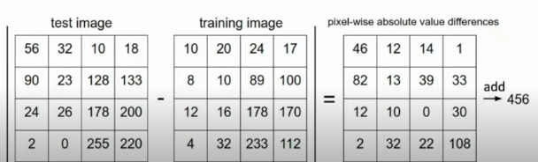

# Lecture 2 - Image Classification


Image Classification: A core computer vision task

input : image 
output: assign image to one of a fixed set of categories

Problem : Semantic gap 
what computer sees is a big grid of numbers 0,255

Challleges: Viewpoint Variation
All pixels change when camera moves

Interclass Variation

Fine-Grained Categories -> different breeds of cats

Background Clutter 

Illuminiation Changes 

Deformation -> various positions

Occlusion -> hidden

## Useful:
    Medical 
    Galaxy 
    Whale

    Object detection : image classification is a subtask of this 

    Image Captioning

    Playing Go

## Image Classifier

no obvious way to hard-code algo for detecting cats

can try with edge detection then find corners ?

-- but different challenges make this not robust


## Machine Learning : Data Driven Approach

    1. Collect a dataset of images and labels
    2. Use Machine Learning to train a classifier
    3. Evaluate the classifier on new images

Rather than having a single functio fot prediction we have two 

```py
def train(images,labels):
    # Machine Learning
    return model
```

```py
def predict(model,test_images):
    #Use model to predict labels
    return test_labels
```

programming computer without defining everything (no expicit programs)


## Data Sources

- MNIST - everything works here not impressive
- CIFAR10
- CIFAR100
- ImageNet - for papers needed 1000 classes (256x256) predicts top 5 accuracy
- MIT places - scene types
- Omniglot - 20 images per category (few shot learning)


## Algorithms

#### Nearest Neighbor

train - Memorize all data and labels

predict - predict label of the most similar training image

only memorises


Distance metric to compare images


L1 Distance 




```py
import numpy as np

class NearestNeighbor:
    def  __init__(self):
        pass
    
    def train(self,X,y):
        """ X is N x D where each row is an example. Y is 1-dimension of size N"""
        # Nearesr neighbor siimply remembers all train data
        self.Xtr = X
        self.ytr = y

    def predict(self,X):
        num_test = X.shape[0]
        # output type match input type
        Ypred = np.zeros(num_test, dtype=self.ytr.dtype)

    # loop over all test rows
    for i in xrange(num_test):
        #find nearet trian image to ith image
        # using L1 distance 

        distances = np.sum(np.abs(self.Xtr - X[i,:]),axis=1)
        min_index = np.argmin(distances)
        Ypred[i]=self.ytr[min_index]

    return Ypred

```

With N examples how fast
O(1)

With N example testing
O(N)

bad can afford slow trainngn but need fast testing.

Decision Boundaries subjected to outliers. How to smooth out?

use more neighbours a set of k neighbors
but somtimes ties between clases -> need to break this

Distnce Metric can be changed
- L1 (Manhattan)
- L2 (Euclidean)

## Hyperparametes

Best value of K
Best value of distance metric

These are choices about learning algo that we don't learn from training data instead we set them at start.

**problem dependent**

### Idea1 : Choose hyperparameters that work best on the data

BAD K = 1 always works


### Idea2 : split data train and test choose what works best on test 


BAD no idea how algo performs in new data


### Idea3 : split data to train, val adn test

choose hyperparametes on val and evaluate on test

Better!


### Ide4: split data to folds

useful for small datasets. not used too frequently computationally expensive


## Universal Approximation

as numnber of training samples goes to infinity nearest neighbor can represent any function 

### Problem : curse of dimensionality

uniform coverage odf space, number of training points needed grows exponentially with dimension

Why nearest neighbor not used often

- very slow test time
- distnace metrics on pixels are not informative


But works well with feature vectors


Nearest neighbor with ConvNet features work really welll


